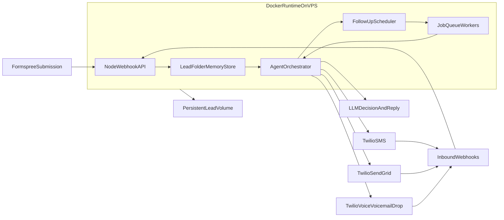

# Node + VPS Speed-to-Lead Plan (Filesystem Memory)

## Target Outcome

Ship a production-ready backend that receives leads from Formspree and runs a stateful, multi-step agent that:

- responds immediately,
- qualifies leads with conversation memory,
- branches by lead intent,
- sends SMS + email + voicemail drop,
- persists all lead memory in a per-lead folder,
- runs automated follow-up sequences.

## Proposed Architecture

## Scope Boundaries (Exact Do / Don’t)

- **Lead Intake Agent**
  - Do: accept/validate Formspree webhook, normalize payload, create lead + first conversation event.
  - Don’t: make qualification decisions or send channel messages directly.
- **Memory Store Agent**
  - Do: persist each lead in its own folder, append transcript/events, and load context for each turn.
  - Don’t: overwrite prior events, perform non-atomic writes, or silently mutate history.
- **Conversation Agent**
  - Do: generate first reply + next qualifying question using stored conversation memory.
  - Don’t: send pricing promises, legal guarantees, or unsupported service commitments.
- **Branching Router**
  - Do: route by `intent`, `urgency`, `lead_score`, `channel_preference`, `response_timeout`.
  - Don’t: bypass escalation rules or handoff controls.
- **Outreach Agents (SMS/Email/Voicemail)**
  - Do: deliver approved content on allowed channels with retry logic.
  - Don’t: send outside quiet hours or after opt-out.
- **Follow-up Agent**
  - Do: enqueue timed follow-ups and stop on response, booking, opt-out, or handoff.
  - Don’t: continue after terminal states.

## Codebase Layout (Planned)

- `[.env.example](/Users/joshuakuski/Desktop/MacroLab/Agent-Sandbox/speed-to-lead/.env.example)` - required env vars including `FORMSPREE_FORM_ID`.
- `[package.json](/Users/joshuakuski/Desktop/MacroLab/Agent-Sandbox/speed-to-lead/package.json)` - scripts + dependencies.
- `[src/server.ts](/Users/joshuakuski/Desktop/MacroLab/Agent-Sandbox/speed-to-lead/src/server.ts)` - app bootstrap and route registration.
- `[src/routes/formspreeWebhook.ts](/Users/joshuakuski/Desktop/MacroLab/Agent-Sandbox/speed-to-lead/src/routes/formspreeWebhook.ts)` - lead intake endpoint.
- `[src/routes/inboundTwilio.ts](/Users/joshuakuski/Desktop/MacroLab/Agent-Sandbox/speed-to-lead/src/routes/inboundTwilio.ts)` - inbound SMS/voice callbacks.
- `[src/agent/orchestrator.ts](/Users/joshuakuski/Desktop/MacroLab/Agent-Sandbox/speed-to-lead/src/agent/orchestrator.ts)` - state machine + branching.
- `[src/storage/leadStore.ts](/Users/joshuakuski/Desktop/MacroLab/Agent-Sandbox/speed-to-lead/src/storage/leadStore.ts)` - filesystem memory read/write primitives.
- `[src/storage/fileLocks.ts](/Users/joshuakuski/Desktop/MacroLab/Agent-Sandbox/speed-to-lead/src/storage/fileLocks.ts)` - lock strategy for concurrent writes.
- `[src/storage/leadFolderSchema.ts](/Users/joshuakuski/Desktop/MacroLab/Agent-Sandbox/speed-to-lead/src/storage/leadFolderSchema.ts)` - schema and validation for lead folder files.
- `[src/channels/twilioSms.ts](/Users/joshuakuski/Desktop/MacroLab/Agent-Sandbox/speed-to-lead/src/channels/twilioSms.ts)` - outbound SMS.
- `[src/channels/sendgridEmail.ts](/Users/joshuakuski/Desktop/MacroLab/Agent-Sandbox/speed-to-lead/src/channels/sendgridEmail.ts)` - outbound email (Twilio SendGrid).
- `[src/channels/twilioVoice.ts](/Users/joshuakuski/Desktop/MacroLab/Agent-Sandbox/speed-to-lead/src/channels/twilioVoice.ts)` - voicemail drop flow.
- `[src/jobs/followups.ts](/Users/joshuakuski/Desktop/MacroLab/Agent-Sandbox/speed-to-lead/src/jobs/followups.ts)` - delayed follow-up jobs.
- `[src/jobs/backups.ts](/Users/joshuakuski/Desktop/MacroLab/Agent-Sandbox/speed-to-lead/src/jobs/backups.ts)` - folder snapshot/export job.
- `[data/leads/](/Users/joshuakuski/Desktop/MacroLab/Agent-Sandbox/speed-to-lead/data/leads/)` - per-lead folders persisted on local disk/VPS volume.
- `[Dockerfile](/Users/joshuakuski/Desktop/MacroLab/Agent-Sandbox/speed-to-lead/Dockerfile)` and `[docker-compose.yml](/Users/joshuakuski/Desktop/MacroLab/Agent-Sandbox/speed-to-lead/docker-compose.yml)` - VPS deploy.

## Data Model (OpenClaw-Style Filesystem Memory)

Per-lead folder layout:

- `data/leads/<leadId>/lead.json` (source, contact, status, tags, score)
- `data/leads/<leadId>/conversation.json` (state, channel preference, last intent, memory summary)
- `data/leads/<leadId>/messages.ndjson` (append-only inbound/outbound transcript events)
- `data/leads/<leadId>/decisions.ndjson` (agent decisions and branch reasons)
- `data/leads/<leadId>/followups.json` (sequence plan, schedule, attempts, terminal reason)
- `data/leads/<leadId>/meta/status.json` (timestamps, delivery status, handoff flags)
- `data/index/by-phone.json` and `data/index/by-email.json` (fast dedupe/lookup indexes)

## Containerization Requirement

- Run the backend as a Dockerized Node service (not bare-metal Node).
- Mount `data/leads/` as a persistent host volume so lead memory survives container restarts/redeploys.
- Use `.env`/secret injection at runtime (do not bake secrets into image layers).
- Add Docker healthcheck endpoint and restart policy.
- Prefer `docker compose` on VPS for operations, even if the MVP runs as a single app container.

## Workflow Design

1. Formspree webhook hits Node endpoint.
2. Validate form id (`FORMSPREE_FORM_ID`) and normalize lead data.
3. Create or load `data/leads/<leadId>/` folder and write initial files.
4. Run orchestration decision (first response + qualification question).
5. Send SMS/email immediately; optionally trigger voicemail drop for high-intent/no-response branches.
6. Append all provider responses and delivery status callbacks to NDJSON event files.
7. Inbound replies re-enter same conversation and continue branching logic.
8. Schedule and execute follow-up sequence until terminal condition.
9. Create periodic compressed snapshots for backup/export.

## Follow-up Sequence (MVP)

- `T+5m`: reminder if no reply.
- `T+2h`: alternate channel follow-up.
- `T+24h`: final attempt + booking CTA.
- Stop rules: replied, booked, opted out, handed off, or max attempts reached.

## Reliability + Safety Requirements

- Idempotency keys on webhooks and outbound sends.
- Queue-based retries with exponential backoff.
- Quiet hours + opt-out enforcement.
- Structured logs + per-conversation trace IDs.
- Atomic writes (`tmp` + rename) and file locks for concurrent worker safety.
- Dead-letter queue for failed outbound and file persistence jobs.
- Nightly backups of `data/leads/` to durable object storage.

## Delivery Phases

- **Phase 1 (Core engine)**: webhook intake, filesystem memory schema, orchestration state machine, SMS/email.
- **Phase 2 (Full channels)**: voicemail drop, inbound callbacks, follow-up scheduler.
- **Phase 3 (Ops hardening)**: backup/restore tooling, monitoring dashboard, VPS hardening and deployment.

## Feasibility (Local/VPS vs Serverless)

- **Local**: fully feasible for development and single-operator usage.
- **VPS**: fully feasible and recommended for production with Docker + mounted persistent volume.
- **Vercel/serverless**: not ideal for this memory model because function filesystems are ephemeral and background jobs are constrained.
- **If you need serverless later**: move memory to object storage or a database-backed event store.

## Open Assumptions (to finalize during implementation)

- Email channel uses **Twilio SendGrid** (Twilio ecosystem) rather than raw SMTP.
- Voicemail drop uses Twilio Programmable Voice callback flow.
- Initial deployment runs as a single worker process; horizontal scale comes after introducing shared locks/storage.

Reference: [Tweet source](/Users/joshuakuski/Desktop/MacroLab/Agent-Sandbox/speed-to-lead/tweet.md)
